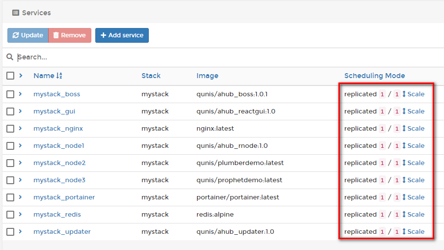

# Introduction 
AHUB is a framework for deploying analytical application inside docker containers.


The framework aims at providing a unified approach to run scripts in any language (R, Python, etc...) while offering common services for most deployment scenarios:

- a graphical user interface
- access control (via Basic Auth, Active Directory or AAD)
- process management and logging functionality
- easy scalability

Docker swarm is able to run a collection of containers simultaneously such that they can communicate with each other over a shared virtual network. Docker swarm has a multitude of features which makes it a powerful tool even in large scale deployment. AHUB provides a pre-configured swarm setup to deploy analytical containers (based on R or any other language) with minimal effort.

# Getting Started

## Generating certificates and user credentials

AHUB comes with a pre-generated certificate and password file. But of course you want to change these. This is very quickly done, with two little helper containers. All you need to do is navigate to the subfolder *./configs* and run the following commands (please fill in your username and password). This will create a new **SSL certificate and key** along with a **.htpasswd file** containing the MD5 hashed credentials for your user in the subfolder *./configs*.

```(powershell)
docker run --mount type=bind,src=$pwd,dst=/var qunis/openssl
docker run --mount type=bind,src=$pwd,dst=/var qunis/htpasswd username password
```

## Configuring the stack

Docker swarm operates with a recipe, telling it which containers to spin up, which ports to publish, which volumes to mount, et cetera. Everything you would normally  configure in a single "docker run ..." statement for a singular container instance, we instead write down in the so called **Compose file** when working with docker swarm. For a more detailed introduction see here. 

Please inspect the demo file in the main folder

```(yaml)
version: '3.3'
services:

# -------------------------------------------
# NODE STACK (add analytical modules here)
# -------------------------------------------
# For compatibility with AHUB, container images
# need to comply with the following:
#   - publish a REST API on port 8000
#   - provide a swagger.json file in the "/" path (only for GUI)
# -------------------------------------------

  node1:
    image: qunis/ahub_rnode:1.0

# -------------------------------------------
  
  node2:
    image: qunis/plumberdemo

# -------------------------------------------
  
  node3:
    image: qunis/prophetdemo
    
# -------------------------------------------
# SERVICE STACK (DO NOT TOUCH)
# -------------------------------------------

  nginx:
    image: nginx
    ports:
      - "80:80"
      - "443:443"
    configs:
      - source: nginx_template.conf
        target: /etc/nginx/nginx.conf
    secrets:
      - source: server.crt
        target: server.crt
      - source: server.key
        target: server.key
      - source: htpasswd
        target: .htpasswd
    deploy:
      placement:
        constraints: [node.role == manager]

...(continues)...

```
The **first block** defines the **node stack**. Here you can add as many container images as you like. For compatibility with AHUB it is only required that plumber (or any other API) publishes on port 8000 and provides the Swagger definition file (if you want to use the GUI functionality). The latter is achieved by running the plumber *$run* command with parameter swagger=TRUE.

**Important:** The analytical nodes do not have to be R based. A python node running a combination of *flask/flasgger* would be compatible as well.

The **second block** constitutes the **service stack** and does not need to be changed, if you stick to the basic scenario with self-signed certificates and basic authentication. Changes here need to be made if you want to use more elaborate functionality like auto-refreshing Let's Encrypt certificates or Active Directory Authentication. These use-cases will be covered in future tutorials.

For now you can either leave the demo file as is or add/substitute your own container images in the node stack! 

**Note:** There is no need to configure nginx when adding containers in the node stack. This is all taken care of by AHUB.Ramping up the swarmBefore we launch AHUB we need to prepare the docker daemon to run in swarm mode:

```{bash}
> docker swarm init
Swarm initialized: current node (XXX) is now a manager.
```
The whole stack can be launched by docker in swarm mode with the following command
```{bash}
docker stack deploy -c ./ahub.yaml mystack
```
This command references the Compose file *ahub.yaml* to deploy a stack called *mystack*. Of course you can change the name of your stack to your liking.You should see the following output on the shell:
```{bash}
> docker stack deploy -c ./ahub.yaml mystack

Creating network mystack_default
Creating secret mystack_server.key
Creating secret mystack_htpasswd
Creating secret mystack_server.crt
Creating config mystack_location_template.conf
Creating config mystack_nginx_template.conf
Creating config mystack_upstream_template.conf
Creating service mystack_portainer
Creating service mystack_node1
Creating service mystack_node2
Creating service mystack_node3
Creating service mystack_nginx
Creating service mystack_redis
Creating service mystack_boss
Creating service mystack_gui
Creating service mystack_updater
>
```
AHUB comes with an instance of **Portainer**, a very powerful browser-based container management tool. We can start checking if everything ramped up fine, by navigating to http://localhost::9000 (Portainer listens on this port). 

As you are starting this cluster for the first time, you need to set an admin account and then choose the **Local mode**. After that you get to the Portainer main page, where you can click through the items Services, Containers and what else piques your interest. With Portainer you can do almost anything you can do from the docker command line interface.

Under the Services tab you should see 9 services if you stuck to the demo file. Three of them being the nodestack comprising of node1, node2 and node3. Everything is fine when you see a 1/1 behind each service.



## Checking the API endpoints
You can now navigate to your endpoints via https://localhost/{nodename}/{endpoint}?{parameters}. For example https://localhost/node2/plot or https://localhost/node3/?n=24. You will be warned by your browser about the insecure certificate (because we have self-signed it, skip this warning) and be asked for the user credentials.

There is also a rudimentary GUI at https://localhost (still under development) showing you the various nodes and their endpoints so you can manually trigger a GET request for testing purposes.


# Contribute

Please get in contact with me at mailto:martin.hanewald@qunis.de if you are interested in contributing. I am especially looking for a frontend developer. So if your are keen on ReactJS, give me a shout.